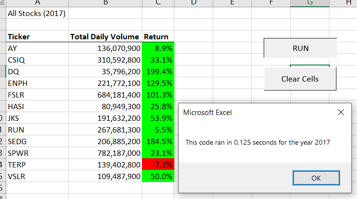
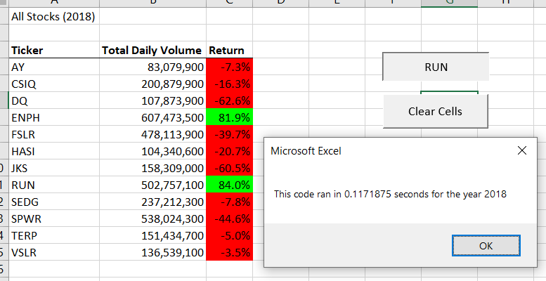

# stock-analysis

### Purpose of this project is to analyze Green Enery stock data for years 2017 - 2018 and provide insights on which is the best stock that can be added to the client's portfolio. VBA has been used to acheive this. The VBA script has also been refactored to make the macro more robust and faster. Details are provided below.

## Analysis of Green Energy Stocks

### Analysis of DAQO New Energy Corp (Ticker: DQ) - Client's preferred choice

  - After carefully analyzing and reviewing the stock performance of DQ for the year 2018, it has been observed that this ticker has not given any positive returns and has resulted in a negative return of -62.6%. Due to this, it is highly recommeneded to avoid adding this company to your portfolio.

## Results:

### Code built to analyze all other stocks for years 2017 - 2018.

  - At first, the output sheet is formatted by adding a Sheet header and row headers. This is done by using the below code:
    ```
        'Sheet Header
        Cells(1, 1) = "All Stocks (" + yearvalue + ")"
        
        'Create a header row
        Cells(3, 1) = "Ticker"
        Cells(3, 2) = "Total Daily Volume"
        Cells(3, 3) = "Return"
    ```
    - An array has been initialized for all 12 tickers in the worksheet and values have been assigned.
    ```
        'assigning values to elemnets in array
        tickers(0) = "AY"
        tickers(1) = "CSIQ"
        tickers(2) = "DQ"
        tickers(3) = "ENPH"
        tickers(4) = "FSLR"
        tickers(5) = "HASI"
        tickers(6) = "JKS"
        tickers(7) = "RUN"
        tickers(8) = "SEDG"
        tickers(9) = "SPWR"
        tickers(10) = "TERP"
        tickers(11) = "VSLR"
    ```
    - Using 'For' loops and If-then statements, the array is used to loop through all rows in the worksheet to aggregate volume, starting price and ending price of each ticker.
    ```
    For i = 0 To 11
        ticker = tickers(i)
        totalVolume = 0
        
    'Loop through rows in the data.
        Worksheets(yearvalue).Activate
        For j = 2 To rowcount
    
        'a.Find the total volume for the current ticker.
        If Cells(j, 1).Value = ticker Then
            
            totalVolume = totalVolume + Cells(j, 8).Value
        
        End If
        
        'b.Find the starting price for the current ticker.
        If Cells(j, 1).Value = ticker And Cells(j - 1, 1).Value <> ticker Then
            
            startingprice = Cells(j, 6).Value
        
        End If
        
        'c.Find the ending price for the current ticker.
        If Cells(j, 1).Value = ticker And Cells(j + 1, 1).Value <> ticker Then
            
            endingprice = Cells(j, 6).Value
        
        End If
        
     Next j
    ```
    - The output data is inserted on the output sheet using the below lines of code and the 'For' loop is then closed.
    ```
    Worksheets("All Stocks Analysis").Activate
        Cells(4 + i, 1).Value = ticker
        Cells(4 + i, 2).Value = totalVolume
        Cells(4 + i, 3).Value = ((endingprice - startingprice) / startingprice)

    Next i
    ```
    - The output table is formatted using the below lines of code
    ```
    Worksheets("All Stocks Analysis").Activate
    Range("A3:C3").Font.Bold = True
    Range("A3:C3").Font.FontStyle = "Bold Italic"
    Range("A3:C3").Borders(xlEdgeBottom).LineStyle = xlContinuous

    Range("B4:B15").NumberFormat = "#,#"
    Range("C4:C15").NumberFormat = "0.0%"
    Columns("A:C").AutoFit

    dataRowStart = 4
    dataRowEnd = 15

    For i = dataRowStart To dataRowEnd

    If Cells(i, 3) > 0 Then
    
        Cells(i, 3).Interior.Color = vbGreen
    
    
    ElseIf Cells(i, 3) < 0 Then
        Cells(i, 3).Interior.Color = vbRed
        
    
    Else: Cells(i, 3).Interior.Color = xlNone
    
    End If

    Next i
    ```
    
    - Summary of the analysis for years are below:
        
      

      


    - The total runtime for this code for each year is as follows:

      

      
      
      
  ## Refactoring the above to run faster.
  
  ### To optimize code and reduce the time taken to run the query, the following changes have been made:
  
  - Intorduced a new variable that wil loop through the data one time and collect all of the information
  ```
      '1a) Create a ticker Index
        
        Dim tickerIndex As Integer
        
        tickerIndex = 0
  ```
  
  - Three new output arrays have been created.
  ```
        Dim tickerVolumes(12) As Long
        Dim tickerStartingPrices(12) As Single
        Dim tickerEndingPrices(12) As Single
  ```
  
  - Loop over all the rows in the spreadsheet.
  ```            
         For i = 2 To rowcount
  ```  
        
   - Increase volume for current ticker
        
  ```
       tickerVolumes(tickerIndex) = tickerVolumes(tickerIndex) + Cells(i, 8).Value
  
  ```        
        
   - Check if the current row is the first row with the selected tickerIndex.
       
   ```    
        If Cells(i - 1, 1).Value <> tickers(tickerIndex) Then

            tickerStartingPrices(tickerIndex) = Cells(i, 6).Value

        End If
   ```     
   
   - check if the current row is the last row with the selected ticker
   
   
       
   ```    
       'If the next row’s ticker doesn’t match, increase the tickerIndex.

              If Cells(i + 1, 1).Value <> tickers(tickerIndex) Then

                  tickerEndingPrices(tickerIndex) = Cells(i, 6).Value

                  '3d Increase the tickerIndex.

                  tickerIndex = tickerIndex + 1

              End If

          Next i
   ```
    
   - Loop through your arrays to output the Ticker, Total Daily Volume, and Return.
   
   ```
    For i = 0 To 11
        
        Worksheets("All Stocks Analysis").Activate
        tickerIndex = i
            Cells(i + 4, 1).Value = tickers(tickerIndex)
            Cells(i + 4, 2).Value = tickerVolumes(tickerIndex)
            Cells(i + 4, 3).Value = tickerEndingPrices(tickerIndex) / tickerStartingPrices(tickerIndex) - 1
            
    Next i
   ```

  ### Final summary of the analysis for years are below and the time taken to run the code for each year:
        
  - Below are the screenshots of the pop up messages showing the time taken for the code to run for each year:
    


    
  
   - Clearly the refactored code runs much faster than the initial code.
  
# SUMMARY:

## Advantages and Disadvantages of refactoring a code in general.

  ### 1. Advantages of refactoring the code:

  - When writing a code for the first time, the plan that's laid out will not the most effective way as we are breaking the process into multiple steps. By refactoring you are using these steps to make the process/code 'whole'.
  - Codensing the code improves the quality and makes it more robust
  - Sometimes this gives an opportunity to add more features than initially thought of.

  ### 2. Disadvantages of refactoring the code:
  - It is not practical on the job, as its time consuming.
  - Refactoring can make it less easier for the reader to understand the code.

## Advantages and disadvantages of refactoring the VBA code for this project.

  ### 1. Advantages of refactoring this code:
  - Saves quite a lot of time for Steve everytime he runs this macro.
  - Gave us the opportunity to revisit the code and make any enhancements.
  - The quality of the code now looks more professional.

  ### 2. Disadvantages of refactoring this code:
  - We had to rework on the code though it was initally completing the task without errors.
