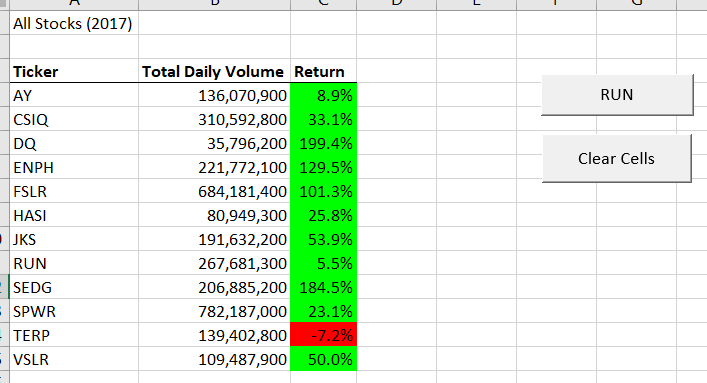
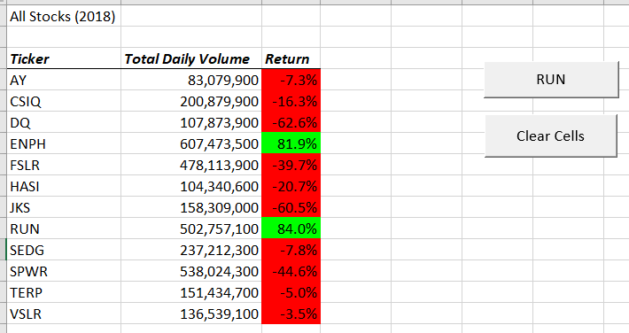
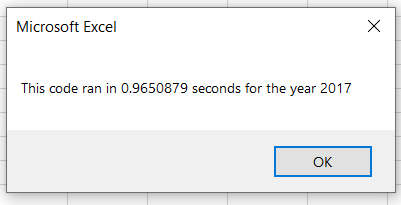
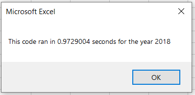

# stock-analysis

### Purpose of this project is to analyze Green Enery stock data for years 2017 - 2018 and provide insights on which is the best to add to the portfolio. VBA has been used to acheive this. The VBA script has also been refactored to make the macro more robust and faster. Details are provided below.

## Analysis of Green Energy Stocks

### Analysis of DAQO New Energy Corp (Ticker: DQ)

  - After carefully analyzing and reviewing the stock performance of DQ for the year 2018, it has been observed that this ticker has not given any positive returns and has resulted in a negative return of -62.6%. Due to this, it is highly recommeneded to avoid adding this company to your portfolio.

## Results:

### Analysis of all other for years 2017 - 2018.

  - At first, the output sheet is formatted by adding a Sheet header and row headers. This is done by using the below code:
    ```
        'Sheet Header
        Cells(1, 1) = "All Stocks (" + yearvalue + ")"
        
        'Create a header row
        Cells(3, 1) = "Ticker"
        Cells(3, 2) = "Total Daily Volume"
        Cells(3, 3) = "Return"
    ```
    - An array has been initialized for all 12 tickers in the worksheet and values has been assigned.
    ```
        'assigning values to elemnets in array
        tickers(0) = "AY"
        tickers(1) = "CSIQ"
        tickers(2) = "DQ"
        tickers(3) = "ENPH"
        tickers(4) = "FSLR"
        tickers(5) = "HASI"
        tickers(6) = "JKS"
        tickers(7) = "RUN"
        tickers(8) = "SEDG"
        tickers(9) = "SPWR"
        tickers(10) = "TERP"
        tickers(11) = "VSLR"
    ```
    - Using multiple 'For' loops and If-then statements, the array is used to loop through all rows in the worksheet to aggregate volume, starting price and ending price of each ticker.
    ```
    For i = 0 To 11
        ticker = tickers(i)
        totalVolume = 0
        
    'Loop through rows in the data.
        Worksheets(yearvalue).Activate
        For j = 2 To rowcount
    
        'a.Find the total volume for the current ticker.
        If Cells(j, 1).Value = ticker Then
            
            totalVolume = totalVolume + Cells(j, 8).Value
        
        End If
        
        'b.Find the starting price for the current ticker.
        If Cells(j, 1).Value = ticker And Cells(j - 1, 1).Value <> ticker Then
            
            startingprice = Cells(j, 6).Value
        
        End If
        
        'c.Find the ending price for the current ticker.
        If Cells(j, 1).Value = ticker And Cells(j + 1, 1).Value <> ticker Then
            
            endingprice = Cells(j, 6).Value
        
        End If
        
     Next j
    ```
    - The output data is inserted on the output sheet using the below lines of code and the 'For' loop is then closed.
    ```
    Worksheets("All Stocks Analysis").Activate
        Cells(4 + i, 1).Value = ticker
        Cells(4 + i, 2).Value = totalVolume
        Cells(4 + i, 3).Value = ((endingprice - startingprice) / startingprice)

        Next i
    ```
    - The output table is formatted using the below lines of code
    ```
    Worksheets("All Stocks Analysis").Activate
    Range("A3:C3").Font.Bold = True
    Range("A3:C3").Font.FontStyle = "Bold Italic"
    Range("A3:C3").Borders(xlEdgeBottom).LineStyle = xlContinuous

    Range("B4:B15").NumberFormat = "#,#"
    Range("C4:C15").NumberFormat = "0.0%"
    Columns("A:C").AutoFit

    dataRowStart = 4
    dataRowEnd = 15

    For i = dataRowStart To dataRowEnd

    If Cells(i, 3) > 0 Then
    
        Cells(i, 3).Interior.Color = vbGreen
    
    
    ElseIf Cells(i, 3) < 0 Then
        Cells(i, 3).Interior.Color = vbRed
        
    
    Else: Cells(i, 3).Interior.Color = xlNone
    
    End If

    Next i
    ```
    
    - Final summary of the analysis for years are below:
        
      

      


    - The total runtime for this code for each year is as follows:

       

      
